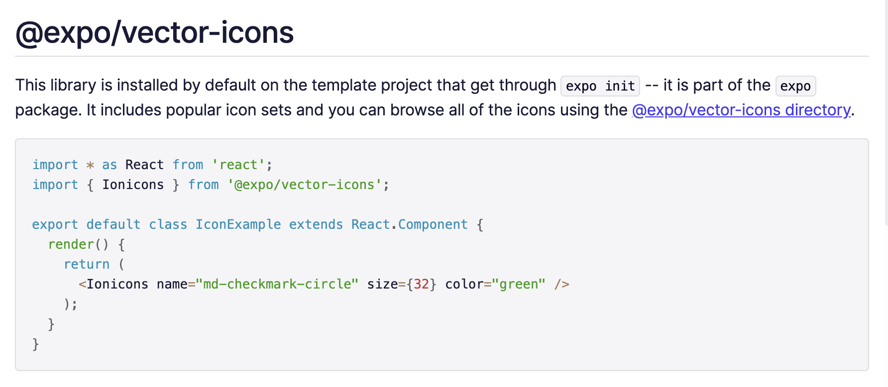

# 2.0 Displaying Temperature (08:59)
https://nomadcoders.co/react-native-fundamentals/lectures/1580

###

## Displaying
 - Api 값으로 정보를 이제 가져온다. Weather 마다 이제 다른 display를 보여주자!
 - 일단 temperature만 먼저 표현해 보자. Weather.js 를 추가한다. 몇개의 prop를 가질 것이라 ```yarn add prop-types``` 해주자! 
 > 아래 이미지 참조
 - <div style="text-align: center;">
      
   </div>
 - 본격적으로 react의 state - props 가 개념이 기본적으로 진행된다!! 가장 근본적이자 (내가 느끼기에) 가상돔의 획기적인 화면 관리 전략! 일단 react 관련 설명은 뛰어넘겠다!
 - API 중 List of weather condition codes가 있다! 아래 설명을 보자
   ```List of weather condition codes with icons (range of thunderstorm, drizzle, rain, snow, clouds, atmosphere including extreme conditions like tornado, hurricane etc.)```
 - 이것을 이용해서 날씨별 아이콘 관리 고고랭! 

# 2.2 Icons and Styling (06:56)

###

## Styling
 - 아이콘을 다루기 전에 expo / vetor-icons를 한 번 살펴보자! [expo/vector-icons](https://docs.expo.io/guides/icons/#expovector-icons)
 - <div style="text-align: center;">
      
   </div>
 - 날씨마다 적절한 icon으로 뿌려주자, 사용법은 아주 간단하다. 컨테이너 안에 아래와 같이 태그 만들어주면 끝
 ``` <MaterialCommunityIcons size={96} name="weather-lightning-rainy" /> ```
 - 컨테이너를 2개로 분리하고, 좀 더 이쁘게 스타일링을 해주자! 

## Linear Gradient
 - 스타일링과 레이아웃을 더 이쁘게 하기 위해서 linear-gradient 모듈을 추가로 사용하자 [Link for Docs](https://docs.expo.io/versions/latest/sdk/linear-gradient/)
 - ```import { LinearGradient } from 'expo-linear-gradient';```
 - 간단하게 보면, 컴포넌트 위에 또 다른 컴포넌트를 말하는 것이라고 할 수 있다. -> **View 대신** 사용 가능하다. 
 - 제일 바깥 쪽 view 대신 예제에 나와있는 것으로 덮어 쒸우자!
 - 상단 바의 컬러감 매치를 위해서 ```<StatusBar barStyle="light-content" />``` 도 추가해주자! 
 - **weatherOptions** object를 이용해 api로 전달 받은 날씨 정보를 기반으로 state ~ props 를 이용해 날씨에 맞는 배경과 아이폰, text를 설정해줄 것이다. 
   - Weather 컨테이너에서 ```weatherOptions[condition].gradient``` 를 이용해서! 
   - 하지만 만약 전달 해준 state 값 (condition)이 우리가 미리 만들어둔 weatherOptions 없다면? error를 일르킨다! 
   > 그래서 우리는 default 이미지, 배경, 정보 등이 필요하다! or 을 써서 아래와 같이 사용한다! 
   - ``` {weatherOptions[condition].iconName || "weather-sunset"} ```

## Titles and Subtitles
 - 가