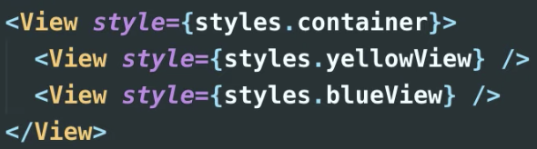

# 1.0 Layouts with Flexbox in React Native (06:25)
https://nomadcoders.co/react-native-fundamentals/lectures/1575

###

## Layouts
 - React Native에서 모든 flex box의 디폴트는 flexDirection이 컬럼이다. 
 - 반면 웹사이트에서 모든 flex박스의 디폴트는 row이다. 아래 사진에서 flex와 부모 자식간에 어떻게 달라지는지 살펴보자 
    
    
 - 그랴서 레이아웃을 기본적으로 flex 기반으로 출발하는 것을 추천한다! 