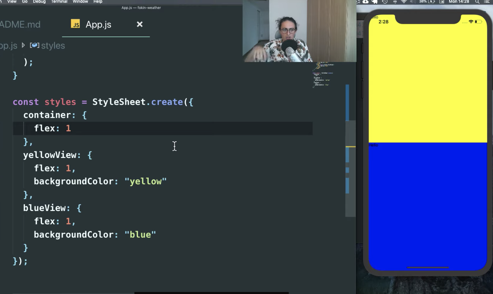

# 1.0 Layouts with Flexbox in React Native (06:25)
https://nomadcoders.co/react-native-fundamentals/lectures/1575

###

## Layouts
 - React Native에서 모든 flex box의 디폴트는 flexDirection이 컬럼이다. 
 - 반면 웹사이트에서 모든 flex박스의 디폴트는 row이다. 아래 사진에서 flex와 부모 자식간에 어떻게 달라지는지 살펴보자 
 <div style="text-align: center;">
   
   
 </div>
 - 그랴서 레이아웃을 기본적으로 flex 기반으로 출발하는 것을 추천한다! 

## Loading Screen
 - Activety / 화면구성, 액티비티 자체를 컴포넌트로 분리할 수 있다. Loading.js 파일 참조
 - 그리고 App.js에서 스타일 시트 등 모두 필요 없을 수 있고, Loading 컴포넌트만 (우리가 만든) 불러오면 된다. 마치 xml 느낌으로 접근 가능! 
 - style을 이제 그 컴포넌트에서 우리가 원하는 대로 바꾸면된다. 코드 참조 
https://github.com/Nuung/weather-app/blob/master/Loading.js 

# 1.2 Getting the Location (07:19)
https://nomadcoders.co/react-native-fundamentals/lectures/1577

###

## Geolocation
 - 리액트 네이티브로 가서 API ~ geolocation 살펴보자!
     ```
    The Geolocation API extends the Geolocation web spec.
    As a browser polyfill, this API is available through the navigator.
    geolocation global - you do not need to import it.

    On Android, this uses the android.location API. This API is not 
    recommended by Google because it is less accurate and slower than the 
    recommended Google Location Services API. In order to use it with 
    React Native, use the react-native-geolocation-service module.
    ```
 - 임포트 해줄 필요는 없지만, 일단 그닥 powerful하지 못하다. 그래도 getCurrentPosition 함수만 필요하다 어짜피!

 - expo에서는 location 이라는 object를 통해서 좀 더 많은 기능을 사용할 수 있는 것을 확인 할 수 있다! [ 살펴보자! ](https://docs.expo.io/versions/latest/sdk/location/#locationinstallwebgeolocationpolyfill)
    - GeoFencing : 만약 사용자가 이 위치에오면 어떤 인터렉션을 할지 이 함수를 통해 구현이 가능하다 .
    ``` expo install expo-location ```

 - **import * as Location from "expo-location";** 으로 다운로드한 모듈을 임포트해서 사용할 수 있다. => 코드 참조하기

# 1.3 Asking for Permissions (07:41)

###

## Permission? 
 - [ 접근 권한에 대한 글! ](https://blog.naver.com/n_privacy/220974897382)

 - location 정보는 사용자(client)에게 꼭 접근 권한을 받아야함. **try - catch 구문**을 이용해보자! 
      - 우리가 permission을 물어보는 것 자체를 만들 필요는 없다!
      - consloe log에 Object 찍이는 것들을 보자! 객체들이 다양한 정보를 이미 가지고 있다! expo를 쓰면 이렇게 간단하는 것이다.
      - >그 object 내부의 'coords' object를 사용할 것이다. ``` console.log(location.coords.altitude, location.coords.longitude); ```
      <div style="text-align: center;">
         
      </div>